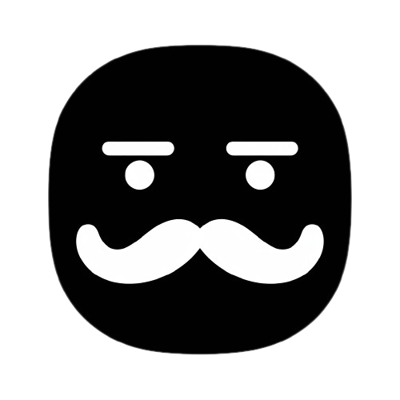

<p align="center">
  
</p>

# jawohl

`jawohl` is a Rust library that helps you deal with JSON produced by Large Language Models (LLM's).
`jawohl` can complete an partial JSON string by automatically adding the missing closing characters (quotes, braces, and brackets). This is particularly useful when you're dealing with streaming JSON strings from LLM's and want to display information without waiting for the inference process to finish.

# Features

- Automatically completes incomplete JSON strings
- Handles nested objects and arrays
- Handles escaped characters inside strings
- Returns an error for malformed JSON input
- _soon_ wrappers published for Javascript and Python

# Installation

Add the following line to your Cargo.toml file under the [dependencies] section:

```toml
jawohl = "0.1.0"
```

# Usage

Here's a basic example showing how to use the JSON Completer library:

```rust
use jawohl::complete_json;

fn main() {
    let input = r#"{"key": "value", "arr": [1, 2, {"nested_key": "nested_value""#;

    assert!(complete_json(input), Ok(r#"{"key": "value", "arr": [1, 2, {"nested_key": "nested_value"}]}"#));
}
```

For more examples and advanced usage, refer to the examples directory. In particular, the [OpenAI Streaming Parse](https://github.com/GenauAI/jawohl/blob/main/examples/openai_streaming_parse/src/main.rs) example shows how to use jawohl to parse a stream of JSON data from OpenAI's API (using [64bit's async-openai library](https://github.com/64bit/async-openai)).

[](https://asciinema.org/a/TaVsv5vvrS36ihoJTs62kaJ0r)

# Running Tests

To run the test suite, run the following command from the root of the repository:

```sh
cargo test
```

This will execute a series of tests covering various scenarios, including nested objects and arrays, escaped quotes, and malformed JSON strings.

# Contributing

We welcome contributions! If you'd like to contribute, please follow these steps:

- Fork the repository on GitHub
- Create a new branch for your feature or bugfix
- Commit your changes and push the branch to your fork
- Create a pull request against the main repository

Please ensure that your code follows Rust's best practices and includes tests for any new functionality or bugfixes.

# Motivaiton

`jawohl` was inspired by the [untruncate-json library](https://github.com/dphilipson/untruncate-json). We wanted to create a simpler version of `untruncate-json` that was specifically designed for JSON produced by LLM's. `jawohl` will not fix all partial json strings like how `untruncate-json` will, but it will fix the most common cases. `jawohl` is meant to be useful for displaying partial JSON strings from LLM's in a web browser, terminal, or other UI, where you want to display the JSON as it's being generated, without waiting for the inference process to finish and it's not that important that you have to be able to parse the JSON for each token, just for some of them. Additionally, we wanted to write it in Rust so that it could be used in other languages like Python and Javascript. 

# License

This project is licensed under the MIT License.
